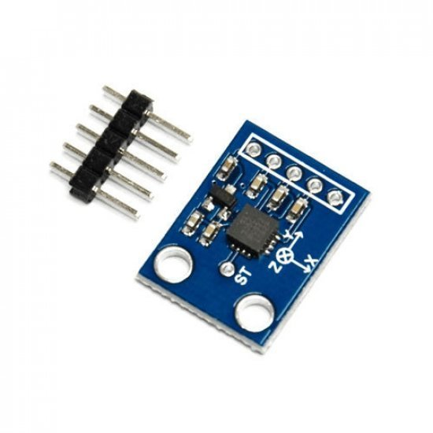
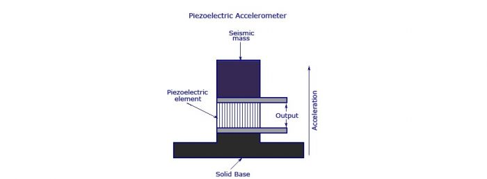

```{r setup, include=FALSE}
knitr::opts_chunk$set(echo = TRUE)
library(tidyverse)
source('Earth_function.R')
```

## Introduction
### ADXL335 3 Axis Accelerometer
This Accelerometer module is based on the popular ADXL335 three-axis analog accelerometer IC, which reads off the X, Y, and Z acceleration as analog voltages. By measuring the amount of acceleration due to gravity, an accelerometer can figure out the angle it is tilted at with respect to the earth. By sensing the amount of dynamic acceleration, the accelerometer can find out how fast and in what direction the device is moving. Using these two properties, you can make all sorts of cool projects, from musical instruments (imagine playing and having the tilt connected to the distortion level or the pitch-bend) to a velocity monitor on your car (or your children’s car). The accelerometer is very easy to interface to an Arduino Micro-controller using 3 analog input pins and can be used with most other microcontrollers, such as the PIC or AVR.
<center>

</center>

## Working of ADXL335 Accelerometer
The most commonly used device is the piezoelectric accelerometer. As the name suggests, it uses the principle of piezoelectric effect. The device consists of a piezoelectric quartz crystal on which an accelerative force, whose value is to be measured, is applied.


<center>

</center>


```{r ADXL335}
  xdata<-sample(x = -19:19,size=20,replace = TRUE)
  ydata<-sample(x = -19:19,size=20,replace = TRUE)
  zdata<-sample(x = -19:19,size=20,replace = TRUE)
  data.frame(
    id = 1:20,
    x=xdata,
    y=ydata,
    z=zdata)->sample_data
  knitr::kable(
  head(sample_data), caption = 'ADXL335 Output',
)
```

### Data of ADXL335 Accelerometer


```{r pressure,fig.align='center'}
    plot.dat= data.frame()
    for (i in 1:20) {
    m = 1+((i-1)*10)
    n = i*10
    x = seq(m,n,0.1)
    sinx = sin(x)*xdata[i]
    siny = cos(x)*ydata[i]
    sinz = sin(x)*zdata[i]
    values = c(sinx,siny,sinz)
    function.type = rep(c("x","y","z"), each = length(x))
    xval = c(x,x,x)
    plot.dat = rbind(plot.dat,data.frame(values, xval, function.type))
    }
    ggplot(plot.dat, 
      aes(x = xval, y = values, colour = function.type))+
      geom_line()+
      theme_minimal()+xlab("Timestamp")+ylab("Magnitude")+labs(tittle = "Ploting Data of X,Y,Z axis")+
      theme(
      plot.title = element_text(color="red", size=14,   face="bold.italic"),
      axis.title.x = element_text(color="#5d9d59", size=14, face="bold"),
      axis.title.y = element_text(color="#993333", size=14, face="bold")
      )
```

## Earth Quake Data
To generate Earthquake data we created generate_earh_quake function in this we pass on the sample size and number of senarios as argument
```{r Earth Quake Data,fig.align='center',fig.width=10,warning=FALSE}
generate_earth_quake(20,10)
```

# Solution

To create threshold model for Earthquake detector we need to first observe the the sin wave of magnitude getting generated
here, we can observe when earthquake happen, values are jumping above 20 and reducing below -20 which means the difference between
normal waves and earthquake is between 20.
```{r threshold_earth,fig.align='center',fig.width=10,warning=FALSE}
generate_earth_quake(20,10)+
    geom_line(aes(y = 20),color = "red" ,linetype = "dashed")+
    geom_line(aes(y = -20),color = "red", linetype = "dashed")
```

To find the difference between them ( Earthquake and Normal ) we will first get sample data to calibrate then take mean of it for all axis. When diffrence between
mean and live data exceed 20 or -20 we will call it as earthquake.

```{r sample_mean}
colMeans(sample_data %>% select(x,y,z) %>% rename("xmean"="x","ymean"=y,"zmean"=z))->sample_mean
sample_mean
```
Now lets take new Input from ADXL335 to calibrate the earthquake by taking difference between mean and live data.

```{r live_data}
sample_mean %>% as.list()->sample_mean
xlive<-30 - sample_mean$xmean
ylive<-40 - sample_mean$ymean
zlive<-35 - sample_mean$zmean
if(xlive< -20 || xlive > 20 || ylive< -20 || ylive > 20 || zlive< -20 || zlive > 20){
  print("earthquake")
}


```


# Arduino Code
```{}
#include<LiquidCrystal.h> // lcd Header
LiquidCrystal lcd(7,6,5,4,3,2); // pins for LCD Connection
 
#define buzzer 12 // buzzer pin
#define led 13 //led pin
 
#define x A0 // x_out pin of Accelerometer
#define y A1 // y_out pin of Accelerometer
#define z A2 // z_out pin of Accelerometer
 
/*variables*/
int xsample=0;
int ysample=0;
int zsample=0;
long start;
int buz=0;
 
/*Macros*/
#define samples 50
#define maxVal 20 // max change limit
#define minVal -20 // min change limit
#define buzTime 5000 // buzzer on time
 
void setup()
{
lcd.begin(16,2); //initializing lcd
Serial.begin(9600); // initializing serial
delay(1000);
lcd.print("EarthQuake ");
lcd.setCursor(0,1);
lcd.print("Detector ");
delay(2000);
lcd.clear();
lcd.print("Calibrating.....");
lcd.setCursor(0,1);
lcd.print("Please wait...");
pinMode(buzzer, OUTPUT);
pinMode(led, OUTPUT);
buz=0;
digitalWrite(buzzer, buz);
digitalWrite(led, buz);
for(int i=0;i<samples;i++) // taking samples for calibration
{
xsample+=analogRead(x);
ysample+=analogRead(y);
zsample+=analogRead(z);
}
 
xsample/=samples; // taking avg for x
ysample/=samples; // taking avg for y
zsample/=samples; // taking avg for z
 
delay(3000);
lcd.clear();
lcd.print("Calibrated");
delay(1000);
lcd.clear();
lcd.print("Device Ready");
delay(1000);
lcd.clear();
lcd.print(" X Y Z ");
}
 
void loop()
{
int value1=analogRead(x); // reading x out
int value2=analogRead(y); //reading y out
int value3=analogRead(z); //reading z out
 
int xValue=xsample-value1; // finding change in x
int yValue=ysample-value2; // finding change in y
int zValue=zsample-value3; // finding change in z
 
/*displying change in x,y and z axis values over lcd*/
lcd.setCursor(0,1);
lcd.print(xValue);
lcd.setCursor(6,1);
lcd.print(yValue);
lcd.setCursor(12,1);
lcd.print(zValue);
delay(100);
 
/* comparing change with predefined limits*/
if(xValue < minVal || xValue > maxVal || yValue < minVal || yValue > maxVal || zValue < minVal || zValue > maxVal)
{
if(buz == 0)
start=millis(); // timer start
buz=1; // buzzer / led flag activated
}
 
else if(buz == 1) // buzzer flag activated then alerting earthquake
{
lcd.setCursor(0,0);
lcd.print("Earthquake Alert ");
if(millis()>= start+buzTime)
buz=0;
}
 
else
{
lcd.clear();
lcd.print(" X Y Z ");
}
 
digitalWrite(buzzer, buz); // buzzer on and off command
digitalWrite(led, buz); // led on and off command
 
/*sending values to processing for plot over the graph*/
Serial.print("x=");
Serial.println(xValue);
Serial.print("y=");
Serial.println(yValue);
Serial.print("z=");
Serial.println(zValue);
Serial.println(" $");
}
```


